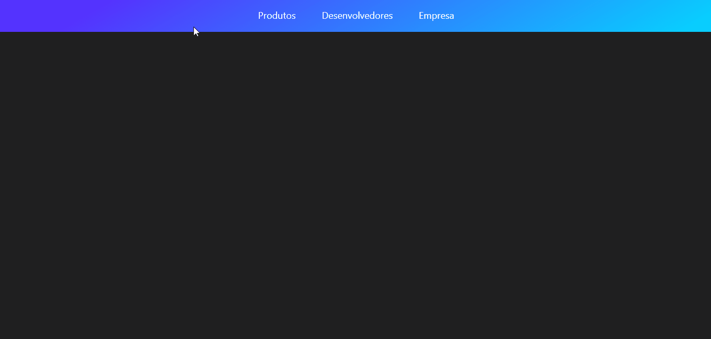

# ⚙️ Projeto
O projeto consiste em um clone do menu do site <a href="https://stripe.com/en-br">Stripe</a> utilizando ReactJS, Styled Components e a biblioteca Framer Motion. Foi desenvolvido durante o vídeo <a href="https://www.youtube.com/watch?v=B7V0q0ZSz2o">Menu do Stripe com ReactJS | UI Clone #7</a>, do canal <a href="https://www.youtube.com/channel/UCSfwM5u0Kce6Cce8_S72olg">Rocketseat</a>.

# ✈️ Tecnologias
- <a href="https://pt-br.reactjs.org/">ReactJS</a>
- <a href="https://styled-components.com/">Styled Components</a>
- <a href="https://www.framer.com/motion/">Framer Motion</a>

# 🖥️ Resultado

  
  
Confira o resultado: <a href="https://stripe-menu-clone-ruuuff.netlify.app/">Stripe Menu Clone</a>

